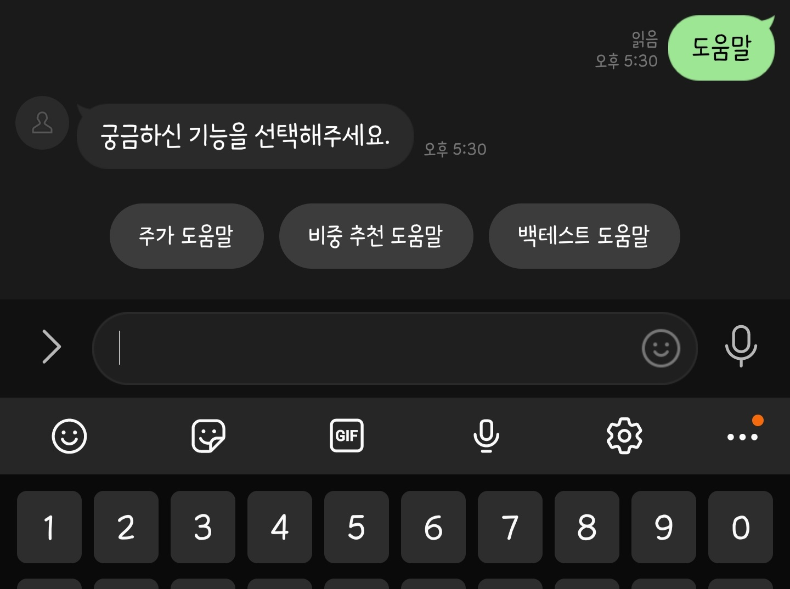
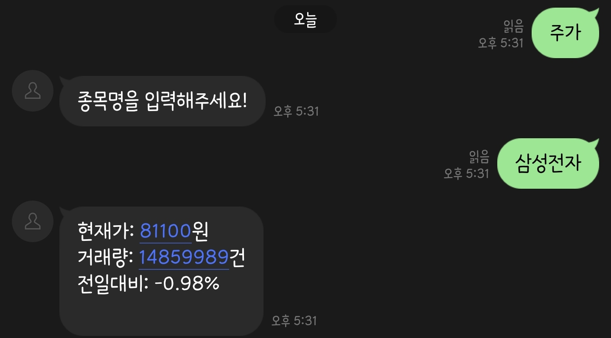
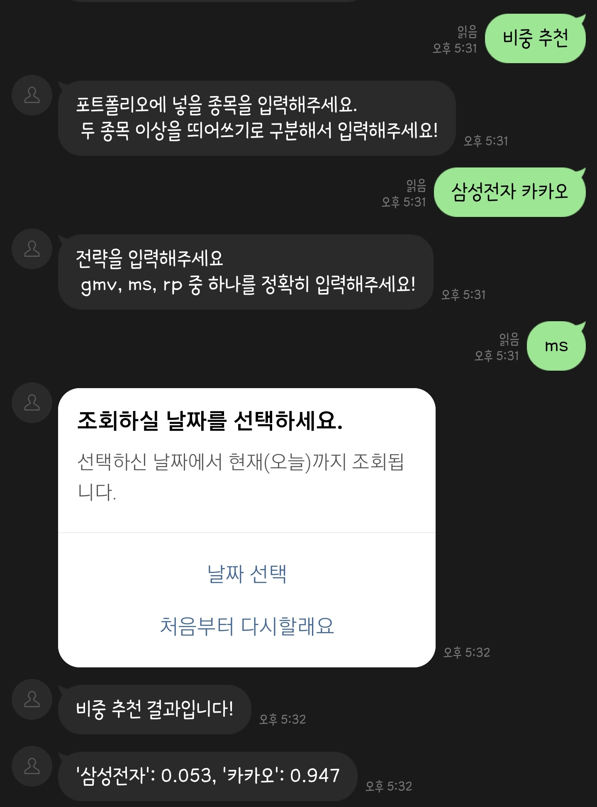
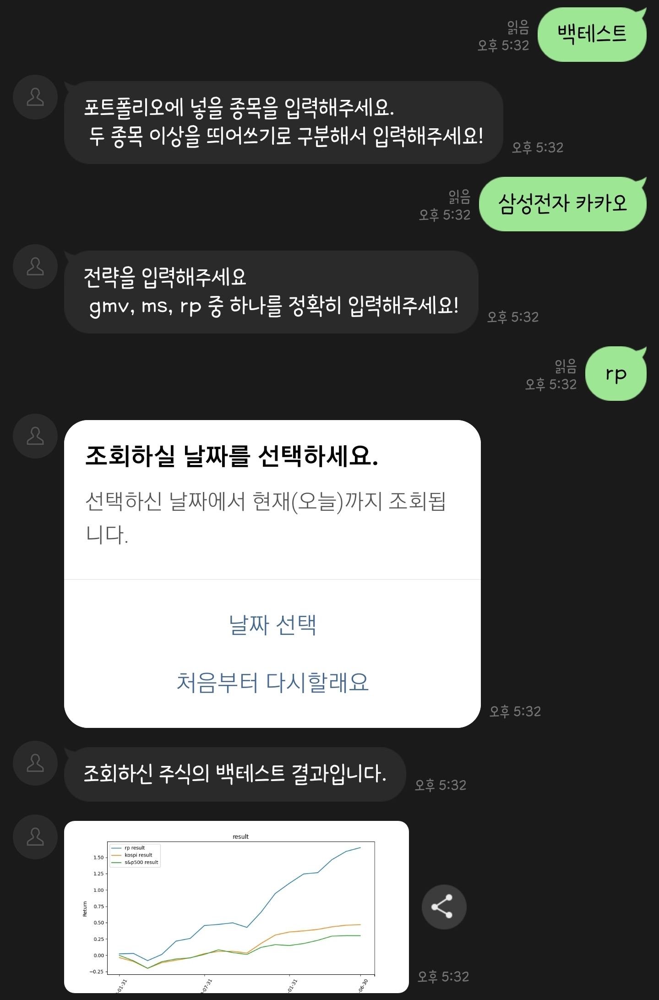
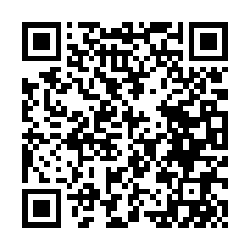

<!-- TABLE OF CONTENTS -->

  
목차

  <ol>
    <li>
      <a href="#프로젝트 설명">프로젝트 설명</a>
      <ul>
        <li><a href="#사용한 언어">사용한 언어</a></li>
      </ul>
    </li>
    <li>
      <a href="#프로젝트 시작">프로젝트 시작</a>
    </li>
    <li><a href="#사용 법">사용 법</a></li>
    <li><a href="#연락처">연락처</a></li>
    <li><a href="#데모">데모</a></li>
  </ol>

### 프로젝트 설명
최근 주식에 대한 관심이 급격히 늘어났다.  
투자자들은 흔히 어떠한 전략대로 일관되게 투자했다면 지금 돈을 얼마나 벌었을까? 를 생각한다.  
이를 확인해보는 작업을 백테스트라고 한다.  
투자자들을 위해 간편하게 주식에 대한 정보, 포트폴리오 비중 추천, 백테스트(성과확인)기능을 라인 챗봇을 통해 제공한다.  

### 사용한 언어
* [Node.js](https://nodejs.org/ko/)
* [python](https://www.python.org/)

### 프로젝트 시작

> 레포지토리 클론하기

> > git clone http://khuhub.khu.ac.kr/2017103989/stock_chatbot.git

> npm install

> > npm install

> .env 작성하기

> > vi .env

> > TOKEN = 'ENTER YOUR CHANNEL ACCESS TOKEN'
> > domain = 'ENTER YOUR DOMAIN'

### 사용 법

1. 도움말 확인하기
 -> "도움말" 입력

2. 주가 정보 불러오기  
 -> "주가" 입력
 -> 주식명 입력

3. 포트폴리오 비중 추천  
 -> "비중 추천" 입력
 -> 주식명 입력
 -> 시작 날짜 선택
 -> 전략 선택

*gmv : 입력한 기간의 주가 정보를 바탕으로 risk가 가장 적은 종목 비중  
*ms : max sharp , 위험 대비 수익률이 제일 높은 포트폴리오 비중, 즉 가성비가 가장 좋다  
*rp : risk parity 전략, 포트폴리오의 위험을 동일하게 분배. 예를 들어 risk가 큰 종목에는 적게 risk가 작은 종목에는 많이 투자  

4. 백테스트 (성과 확인)  
 -> "백테스트" 입력
 -> 주식명 입력
 -> 시작 날짜 선택
 -> 전략 선택

*사용자가 원하는대로 성과 평가를 진행해줍니다  
*예를 들어서 2010년1월1일부터 2021년 1월 1일의 기간동안 3개월 주기마다 월간 수익률 데이터를 사용해서 gmv 전략을 활용해서 포트폴리오를 구성했을 때 성과를 보여줍니다  
  

    
### 연락처
진주성 - [git_profile]](http://khuhub.khu.ac.kr/u/2016100990)

박하늘 - [git_profile]](http://khuhub.khu.ac.kr/u/2017103989)

프로젝트 링크: [http://khuhub.khu.ac.kr/2017103989/stock_chatbot](http://khuhub.khu.ac.kr/2017103989/stock_chatbot)

### 데모

    

